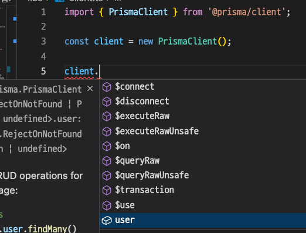

# Carrot market clone

## stack

Next

##

1. npx create-next-app@latest --typescript
2. 삭제
   - pages/api 폴더 삭제
   - styles.Home.module.css 삭제
   - index.tsx 파일에서 return 에 있는거 전부삭제
3. 테일윈드 셋업
   1. `npm install -D tailwindcss postcss autoprefixer` 설치
   2. `npx tailwindcss init -p` 초기설정파일 생성
   3. `tailwind.config.js` 파일 수정

```css
/* global.css */
@tailwind base;
@tailwind components;
@tailwind utilities;
```

```javascript
// tailwind.config.js
module.exports = {
  content: [
    // tailwind 를 사용한 곳
    "./pages/**/*.{js,jsx,ts,tsx}",
    "./components/**/*.{js,jsx,ts,tsx}",
  ],
  theme: {
    extend: {},
  },
  plugins: [],
};
```

## Tour of Tailwind

- `tawilwind` 는 `utility-first css` 이다. (즉 테일윈드가 많은 클레스네임을 갖는 다는 말. 엄청 큰 css 파일이다.)
- 스타일을 할때 클래스 네임을 조합해서 하면 된다.
- `vscode` 의 `extension` : `Tailwind CSS intelliSense `를 설치하면 자동완성 기능을 쓸 수 있다.
- 자동완성이 안뜨면 `컨트롤+스페이스` cmd + space 를 눌러본다

### 자주쓰는 것

- flex
- p 패딩
- m 마진
- bg 백그라운드
- space 자식요소에 마진을 준다 ex) space-y-5 (자식요소에 mt-5 와 mb-5 줄수 있다.) -> tailwind 가 계산해준다 [ helper class ]
- rounded
- gap
- shadow 그림자
- font 글자 굵기
- text 글자크기, 색상, 정렬
- justify 플렉스정렬
- items 플렉스 정렬
- border 테두리
- w 너비 ex) w-2/4 는 width: 50%;
- h 높이
- overflow 오버플로우
- relative : relative 포지션
- -top 음수넣고 싶을 때 ex) -top-14 는 -14 만큼 올라감
- min 최소값 정할 때 ex) min-height-screen
- max
- aspect ex) aspect-square

### Modifier [[문서]](https://tailwindcss.com/docs/hover-focus-and-other-states)

- 일반 css 에서 마우스 호버시 효과를 주려면 `:hover` 선택자를 사용했다.
- tailwind 에서는 `modifier` 를 사용할 수 있다.
- `조건:프로퍼티` ex) `hover:text-black`

```html
<button
  className="mt-5 bg-blue-500 text-white p-3
  text-center rounded-xl w-3/4 mx-auto 
  hover:bg-teal-500 hover:text-black
  active:bg-yellow-500 focus:bg-red-500
  ">
  Checkout
</button>
```

### transition

- focus modifier
- ring utility: ex) `ring-2` , `ring-offset-2`, `ring-yellow-500`
  - 모두 앞에 `focus` 를 해줄 필요는 없다. 다른 애들은 변수에 대한 설정이므로 `focus:ring-2` 만 해도 충분

```html
<div className="space-x-2">
  <button
    className="w-5 h-5 rounded-full bg-yellow-500 focus:ring-2 ring-offset-2 ring-yellow-500 transition" />
  <button
    className="w-5 h-5 rounded-full bg-indigo-500 focus:ring-2 ring-offset-2 ring-indigo-500 transition" />
  <button
    className="w-5 h-5 rounded-full bg-teal-500 focus:ring-2 ring-offset-2 ring-teal-500 transition" />
</div>
```


### modifier for lists

```javascript
<ul>
  {[1, 2, 3, 4].map((i) => (
  <div
    key="{i}"
    className="flex justify-between my-2 odd:bg-blue-50 even:bg-yellow-50 first:bg-teal-50 last:bg-amber-50">
    <span className="text-gray-500">Grey Chair</span>
    <span className="font-semibold">$19</span>
  </div>
  ))}
</ul>
<ul>
  {["a", "b", "c", ""].map((c, i) => (
  <li className="bg-red-500 py-2 empty:bg-blue-500" key="{i}">{c}</li>
  ))}
</ul>
```

- `empty` 에 대해서도 디자인 입힐 수 있다. ex) `empty:hidden`
- hidden 을 해버리면 `display : none` 과 같다
  

### Modifier for group

- 기본 css에서는 특정 컨테이너에 마우스를 올릴때 그 안의 아이템의 스타일을 변경하고 싶다면 아래처럼 했다.

```css
.container:hover .item {
}
```

- tailwind 에서는 이렇게 하면 된다.
  1. 컨테이너에 `group` 이라는 클래스명을 준다
  2. 아이템에게 group 에 마우스를 hover 하면 변화할 것을 정해준다 `group-hover:bg-red-300`

```javascript
<div className="group">
  <div className="group-hover:bg-red-300">
</div>
```

### modifier for forms

- `placeholder-shown`
- `disabled`
- `required`
- `invalid`
- `valid`

  #### peer modifier

  - input의 상태에 따라 span 의 스타일을 변경할 수 있다.
    1. input 을 정하고 `peer` 클래스명을 추가한다.
    2. peer 의 sibling 레이블에 `peer-modifier` 로 스타일을 입힌다.

```html
<form className="flex flex-col space-y-2  p-5 ">
  <input
    type="text"
    required
    placeholder="Username"
    className="border p-1 peer border-gray-400 rounded-md " />
  <span className="hidden peer-invalid:block peer-invalid:text-red-500">
    This input is invalid
  </span>
  <span className="hidden peer-valid:block peer-valid:text-teal-500">
    Awesome username
  </span>
  <span className="hidden peer-hover:block peer-hover:text-amber-500">
    Hello
  </span>
  <input type="submit" value="Login" className="bg-white" />
</form>
```


### more modifiers

#### 많은 사람들이 사용했던 패턴

- `selection` 텍스트를 드래그 할때 스타일
- `open` details 가 열렸을 떄
- `marker` ul 리스트의 왼쪽에 있는 bullet의 스타일

```javascript
<details className='selection-none open:bg-indigo-400'>
  <summary className='selection-none cursor-pointer'>details 의 제목</summary>
  <span className='selection:bg-indigo-600'>내용</span>
</details>
```


```javascript
<ul className='list-disc marker:text-teal-500'>
  <li>item</li>
  <li>item</li>
  <li>item</li>
</ul>
```

#### 파일 인풋 디자인하기

```javascript
<input type="file" className="file:border-0 file:rounded-md file:bg-purple-400" >
```


### modifier 중첩시키기

```javascript
<div className='flex flex-col space-y-2  p-5 '>
  <p className='first-letter:text-7xl first-letter:hover:text-purple-400'>
    Hello everyone!
  </p>
</div>
```


### 응답형 modifier

- tailwind 는 모바일 화면을 위한 스타일이 디폴트다.
- 더 사이즈 큰 경우에 대해 따로 스타일을 설정해 줘야 한다.
- `sm` , `md`, `lg`, `xl`, `2xl`, `portrait`, `landscape`
- 적용시 오른쪽으로 갈수록 큰 사이즈에 대해 스타일을 적용한다.
- `portrait`, `landscape` 는 모바일 방향에 따른 것이다 (device simulator 에서 테스트 해볼 수 있다.)

```javascript
<div className='bg-white sm:hover:bg-pink-800 sm:bg-red-400 md:bg-teal-400 lg:bg-indigo-400 xl:bg-yellow-400 2xl:bg-pink-500  p-6 rounded-3xl shadow-xl'></div>
```

### Dark mode

- 다크모드를 어떻게 활성화시킬지에 따라 고를수 있는 옵션들이 있다
- 디폴트로 다크모드는 컴퓨터 환경에 따라 설정된다. (pc나 모바일을 다크모드로 설정했으면 브라우저도 따라간다.)

1. 브라우저 설정을 따르지 않게 하려면 `tailwind.config.js` 에 `darkmode` 옵션을 `class` 로 변경한다. (`deefault` 는 `darkMode: "media"` )
   - 이렇게 되면, `dark` 클래스를 갖는 부모요소의 모든 자식요소도 다크모드가 적용된다.
   - `class 모드`에서 **다크모드를 토글**하고 싶으면, `dark:` 선택자를 사용하는 요소의 부모요소에 `dark` 클래스를 추가하면 된다. ex) 보통은 body 나 html 태그에 추가한다
2. `dark` 를 클래스명에 넣는다

```javascript
// tailwind.config.js
module.exports = {
  content: [
    "./pages/**/*.{js,jsx,ts,tsx}",
    "./components/**/*.{js,jsx,ts,tsx}",
  ],
  theme: {
    extend: {},
  },
  darkMode: "class",
  plugins: [],
};
```

```javascript
      <div className="bg-white dark:bg-black flex flex-col justify-between p-6 rounded-3xl shadow-xl">
        <span className="font-semibold dark:text-white text-2xl">
          Select Item
        </span>
        <ul>
          <div className="flex justify-between my-2 ">
            <span className="text-gray-500 dark:text-gray-100">Grey Chair</span>
            <span className="font-semibold dark:text-white">$19</span>
          </div>
          <div className="flex justify-between my-2 ">
            <span className="text-gray-500 dark:text-gray-100">Grey Chair</span>
            <span className="font-semibold dark:text-white">$19</span>
```

### tailwind 는 큰파일? (JIT)

- 에전에 배포를 위해 빌드를 하면 필요 없는 css 들을 없애서 용량을 줄이는 과정을 거쳤다. 일명 purging 프로세스
- 지금은 코드를 감시하면서 실시간으로 css를 업데이트 한다

#### tailwind 가 제공하지 않는 옵션을 사용하고 싶은 경우

> `text-9xl` 보다 크게 하려면?

- `text-[500px]` 를 하면 된다! JIT 덕분

- 백그라운드 이미지 넣을 때 : `bg-[url('https://~')]`

## Tailiwnd practice

### tailwind 함수 만들기

-

```javascript
function cls(...classnames: string[]) {
  return classnames.join(" ");
}

<button
  className={cls(
    "pb-4 font-medium border-b-2 ",
    method == "email"
      ? "border-orange-500 text-orange-400"
      : "border-transparent"
  )}></button>;
```

### tailwind plugin : tainwindcss/form

1. form 의 기본 스타일을 갖게 해주는 플러그인을 추가해보자
2. `npm i @tailwindcss/forms` : input 에 reset layer 를 추가할수 있는 플러그인을 설치한다
3. `tailwind.config.js` 에서 `plugins` 배열에 추가해준다. : `plugins: [require("@tailwindcss/forms")]`

```javascript
module.exports = {
  content: [
    "./pages/**/*.{js,jsx,ts,tsx}",
    "./components/**/*.{js,jsx,ts,tsx}",
  ],
  theme: {
    extend: {},
  },
  darkMode: "media", // class
  plugins: [require("@tailwindcss/forms")],
};
```

#### form 태그 사용해보기

1. `appearance-none` 으로 혹시 input 이 갖고 있을지 모르는 기본 스타일을 리셋 시켜보자

```javascript
<form className='flex flex-col mt-8'>
  <label className='text-sm font-medium text-gray-700'>
    {method === "email" ? "Email address" : null}
    {method === "phone" ? "Phone number" : null}
  </label>
  <div className='mt-1'>
    {method === "email" ? (
      <input
        type='email'
        className='appearance-none w-full px-3 py-2 border border-gray-300 rounded-md shadow-sm placeholder-gray-400 focus:outline-none focus:ring-orange-500 focus:border-orange-500'
        required
      />
    ) : null}
    {method === "phone" ? (
      <div className='flex rounded-md shadow-sm'>
        <span className='flex items-center justify-center px-3 rounded-l-md border border-r-0 border-gray-300 bg-gray-50 text-gray-500 select-none text-sm'>
          +82
        </span>
        <input
          type='number'
          className='appearance-none w-full px-3 py-2 border border-gray-300 rounded-md rounded-l-none shadow-sm placeholder-gray-400 focus:outline-none focus:ring-orange-500 focus:border-orange-500'
          required
        />
      </div>
    ) : null}
  </div>
  <button className='mt-5 bg-orange-500 hover:bg-orange-600 text-white py-2 px-4 border border-transparent rounded-md shadow-sm text-sm font-medium focus:ring-2 focus:ring-offset-2 focus:ring-orange-500 focus:outline-none '>
    {method === "email" ? "Get login link" : null}
    {method === "phone" ? "Get one-time password" : null}
  </button>
</form>
```

### tip: divde 클래스

- 컴포넌트 리스트에서 border-bottom 속성으로 밑줄을 그었을 때 마지막 컴포넌트의 밑줄이 안그려지게 하고싶다.
- 방법1: `last:border-b-0` 클래스 명을 추가해주면 된다.

```tsx
<div className='py-10'>
  {[1, 1, 1, 1, 1, 1, 1].map((_, i) => (
    <div
      key={i}
      className='flex px-4 cursor-pointer py-3 items-center space-x-3 border-b last:border-b-0'>
      <div className='w-12 h-12 rounded-full bg-slate-300' />
      <div>
        <p className='text-gray-700'>Steve Jebs</p>
        <p className='text-sm  text-gray-500'>
          See you tomorrow in the corner at 2pm!
        </p>
      </div>
    </div>
  ))}
</div>
```

- 방법2: 부모 요소에서 `divide` 클래스를 사용한다. (divide-y-[1px] 세로방향으로 나눠서 쌓는다. 경계는 1px)
- divide 는 요소 옆에 형제 요소가 있으면 사이에 border를 넣어준다.

```tsx
<div className='py-10 divide-y-[1px] '>
  {[1, 1, 1, 1, 1, 1, 1].map((_, i) => (
    <div
      key={i}
      className='flex px-4 cursor-pointer py-3 items-center space-x-3'>
      <div className='w-12 h-12 rounded-full bg-slate-300' />
      <div>
        <p className='text-gray-700'>Steve Jebs</p>
        <p className='text-sm  text-gray-500'>
          See you tomorrow in the corner at 2pm!
        </p>
      </div>
    </div>
  ))}
</div>
```

### tip: aspect

- `aspect-video`: 영상비율(16:9) 로 만들어준다. (가로를 반응형으로 바꾸면 세로도 알아서 조절됨)
- `aspect-square` : 정사각형 비율로 만들어준다.

## Prisma

- Prisma 는 Node.js 와 Typescript ORM 이다
- SQL 같은 데이터베이스 언어를 안쓰고 Typescript 코드만 작성할 수 있다.
- 한마디로 Prisma 는 편리하게 DB를 사용할 수 있게 해준다.

> ORM (Object Relational Mapping) 이란? <br>
> 객체와 관계형 데이터베이스의 데이터를 자동으로 매핑해주는 것을 말한다.
> 일종의 번역기라 보면 되는데, 자바스크립트(타입스크립트) 코드와 DB 사이를 연결해주는 것이다.

- Prisma 를 사용하기 전에 schema.prisma 파일을 통해 데이터베이스가 어떻게 생겼는지 알려줘야 한다.
  > schema.prisma 는 데이터베이스에 대한 모든 설명을 담은 파일이다.


1. content String? : string 타입. required는 아님
2. published Boolean @default(false) : boolean타입. 디폴트값은 false
3. author User? @relation(fields : [authorId], references: [id]) : User타입(User는 또다른 model)

- Prisma 에 설명해주면 Prisma 는 데이터베이스의 타입을 알게되고 client 를 생성해 줄 수있다.
- client 를 이용하면 타입스크립트로 데이터베이스와 직접 상호작용할 수 있다.
- Prisma Studio 를 통해 시각화된 데이터를 읽을 수도 있다.

### Setup

1. 우선 vscode 에서 `Prisma` extension 을 설치해준다.
2. `npm i prisma -D` : prisma 설치
3. `npx prisma init` : prisma 초기 세팅
   1. .env 파일에 있는 DATABASE_URL 을 설정해준다. -> PlanetScale
   2. prisma/schema.prisma 파일에서 datasource의 provider(사용할 DB)를 설정해준다. -> MySQL
   3. DB에 사용할 model 을 만든다.

```prisma
// prisma/schema.prisma
// learn more about it in the docs: https://pris.ly/d/prisma-schema

generator client {
  provider = "prisma-client-js"
}

datasource db {
  provider = "mysql" //
  url      = env("DATABASE_URL")
}

model User {
  id Int @id @default(autoincrement()) // id로 구분할수 있으며 디폴트로 증가하는 값이다.
  phone Int? @unique // 옵셔널한 Int값이며 유니크하다
  email String? @unique
  name String
  avatar String?
  createdAt DateTime @default(now()) // 현재날자를 디폴트로한다
  updatedAt DateTime @updatedAt // 업데이트마다 이 필드가 변한다
}
```

- prisma 는 schema.prisma 파일을 읽고 변경점을 deploy 한다
- schema.prisma 파일을 읽고 타입스크립트 client 를 생성해 준다.

## PlanetScale

- MySQL 과 호환되는 serverless 데이터베이스 플랫폼
- Database platform : 데이터베이스를 제공한다.
- serverless: 서버를 관리 및 유지보수할 필요가 없다
- vitess 를 사용한다: scaling 기능이 뛰어난 오픈소스 데이터베이스 클러스터링 시스템
- git 을 사용하는 것처럼 데이터베이스를 사용할 수 있는 CLI 를 제공한다.

### 설치하기

1. `brew install planetscale/tap/pscale`
2. `brew install mysql-client`
3. `brew upgrade pscale` : 최신버전으로 업데이트
4. `pscale auth login` : 계정로그인
5. 이제 CLI 기능을 이용할 수 있다.

### PlanetScale 사용하기 [문서](https://github.com/planetscale/cli#installation)

| 명령어                                           | ---                              |
| ------------------------------------------------ | -------------------------------- |
| pscale region list                               | 서버 목록을 보여준다             |
| pscale database create <DB이름>                  | DB를 생성한다                    |
| pscale database create <DB이름> -region <SLUG명> | 해당 지역 서버에 DB를 생성한다.  |
| pscale connect <DB명>                            | PlanetScale서버의 DB와 연결한다. |
| npx prisma db push                               | DB정보를 push한다                |

#### DB를 생성하고 연결하기

1. `pscale database create <DB이름> -region ap-northeast` 로 도쿄 서버에 DB를 생성하자.

> 보통 DB 플랫폼에서는 DB를 만들면 암호를 생성하고 관리해야 하는데 보안에 취약할 수 있기 때문에, 진짜DB 대신 서버를 작동시킬수 있는 가짜DB 를 사용한다. 이 후 실제 배포할 때 AWS 나 Heroku를 이용하면 된다.<br>
> planetscale 에서는 보안 tunnel 을 사용할 수 있다!(가짜 DB를 다운받고 설치하고 실행할 필요가 없고, .env 에 정보를 보관할 이유도 없다.)

2. `pscale connect <DB명>` 를 하면 PlanetScale 서버의 DB와 연결된다.
3. 연결시 나오는 주소를 복사하여 `.env` 의 DATABASE_URL 에 넣어준다.

```js
// .env
DATABASE_URL = "mysql://127.0.0.1:3306/<DB명>";
```

#### DB 를 push 해보기

> planetscale 은 mysql 과 '호환'되는 플랫폼이다. 이 호환을 위해서 몇가지 처리해줄 것이 있다.

> foreign key 제약 <br>
> planetscale 은 mysql 과 달리 foreign 키로 DB에 해당 데이터가 있는지 체크하는 기능이 없기 때문에 안정성을 보완해줘야 한다.

1. `schema.prisma` 파일의 `datasource db` 에다가 `relationMode ="prisma"` 를 추가해준다.

```prisma
// schema.prisma

datasource db {
provider = "mysql"
url = env("DATABASE_URL")
relationMode = "prisma"
}
```

2. `npx prisma db push` 를 하면 schema.prisma 를 읽고 해당 정보를 push 한다.

> Prisma Client 가 생성됨
> 

3. https://app.planetscale.com/[계정명]/[DB명]/branches - [main] 브랜치 - [Schema] 탭 - [Refresh Schema] 를 눌러서 확인하면 SQL 버전의 스키마를 볼수 있다.


### Prisma Studiio

- `npx prisma studio`
  
- [Add record] 버튼을 누르면 데이터를 추가할 수 있다.

### Prisma Client

#### 클라이언트 초기화 하는 방법:

1. `npm i @prisma/client`
2. libs폴더에 `client.ts` 파일을 만들자
3. `client.ts` 파일에 다음을 작성한다.

```ts
import { PrismaClient } from "@prisma/client";

export default new PrismaClient();
```

4. 이제 client 인스턴스를 이용해서 DB와 소통할 수 있다.
5. `npx prisma generate` 를 하면 node_modules/.prisma/client/index.d.ts 에 우리의 스키마에 해당하는 type 이 생성된 걸 알 수 있다.

 6. 또한 PrismaClient 의 인스턴스로 자동완성으로 user모델을 찾을 수 있는 걸 알 수 있다.



> 사용예시

```ts
// libs/client.ts
import { PrismaClient } from "@prisma/client";

const client = new PrismaClient();

client.user.create({
  data: {
    id: 12,
    name: "helo",
  },
});

export default client;
```

### API Routes

> PrismaClient 는 브라우저에서 작동하진 않는다. 왜냐면 db에 접근할수 있는 파일을 프론트엔드인 브라우저에 추가하기 때문

```ts
// pages/indes.tsx
import "../libs/client"; // 에러발생
```

- 원래는 `react`는 프론트엔드를, `node.js` 는 백엔드를 다뤄야 한다.
- 그런데, `NextJS` 는 API 를 만들기 위해 반드시 서버를 따로 구축할 필요가 없다!
- `pages/api` 폴더를 생성하면 **NextJS 서버에 API 가 생성**된다.

> api 폴더 내의 파일은 `export default` 로 함수를 내보내야 한다.

#### api 라우트 만들기

- `pages/api` 폴더에서 `connection 핸들러`인 함수를 `export default` 한다.

```ts
// pages/api/client-test.tsx
import { NextApiRequest, NextApiResponse } from "next";

export default function handler(req: NextApiRequest, res: NextApiResponse) {
  res.json({
    ok: true,
    data: "abc",
  });
}
```

> NextApiRequest


> NextApiResponse


- /api/client-test 에 해당하는 url 에 가면 위에서 정의한 `json`이 나온다
  

> client-test 에 PrismaClient 를 import 해보자

```tsx
// pages/api/client-test.tsx

import { NextApiRequest, NextApiResponse } from "next";
import client from "../../libs/client";

export default async function handler(
  req: NextApiRequest,
  res: NextApiResponse
) {
  await client.user.create({
    data: {
      email: "abc@naver.com",
      name: "hello",
    },
  });
  // res.status(200).end(); 로 하면 항상 200 신호를 보낸다
  res.json({
    ok: true,
  });
}
```

> (브라우저) 핸들러가 실행되면 DB를 업데이트하고 다음 json을 리턴한다.
> 

> (PrismaStudio) DB가 업데이트 된 모습
> 

### 예시

> 유효한 form 에서 submit

```tsx
// enter.tsx
const [submitting, setSubmitting] = useState(false);
const { register, handleSubmit, reset } = useForm<EnterForm>();

const onValid = (data: EnterForm) => { // submit 이 유효할 경우 작동
  setSubmitting(true);
  fetch("/api/users/enter", {
    method: "POST",
    body: JSON.stringify(data),
    headers: {
      "Content-Type": "application/json",
    },
  }).then(() => {
    setSubmitting(false);
  });
};
// return (
<form
  onSubmit={handleSubmit(onValid)}
  className='flex flex-col mt-8 space-y-4'>
```

```tsx
// pages/api/users/enter.tsx
import { NextApiRequest, NextApiResponse } from "next";
import client from "../../../libs/client";

export default async function handler(
  req: NextApiRequest,
  res: NextApiResponse
) {
  if (req.method !== "POST") {
    res.status(401).end(); // POST 가 아닌 메소드로 보내면 에러발생
  }
  console.log(req.body.email); // undefined 나올수 있음
  console.log(req.body); // {"email":"abc@naver.com"}
  res.status(200).end();
}
```

- 헤더를 빼놓고 요청할 경우 `req.body` 는 'req의 인코딩'을 기준으로 `parse`하기 때문에 `req.body.email` 로 접근하면 `undefined` 가 나온다!
- `프론트`에서 요청할 때 `headers` 를 설정해줘야만 한다 : `header : { "Content-Type" : "application/json" }`

#### 커스텀 훅 만들기 순서

1. 사용자 경험을 결정한다. 해당 훅이 무엇을 인자로 받고, 무엇을 리턴할지, 리턴값으로 로직을 어떻게 간추릴 것인지 정한다.
2. 위에서 정한 조건에 맞게 훅의 인풋과 리턴, 그리고 타입에 대해서 정의한다.
3. 훅의 로직을 정의한다.

## 상대경로에서 절대경로 바꾸기

1. `tsconfig.json` 파일에서 `baseUrl: "."` 를 추가한다 : 프로젝트의 baseUrl 을 `tsconfig.json` 파일의 위치로 함
2. `paths` 추가한다 : 파일과 컴포넌트들을 어떻게 import 할지 정한다.

```json
{
  "compilerOptions": {
    "incremental": true,
    "baseUrl": ".",
    "paths": {
      "@libs/*": ["libs/*"], // "@libs/*" 라는 경로는 libs폴더를 의미한다.
      "@components/*": ["components/*"]
    }
  }
}
```

- "../../../libs/server/withHandler" -> "@libs/server/withHandler"
-
